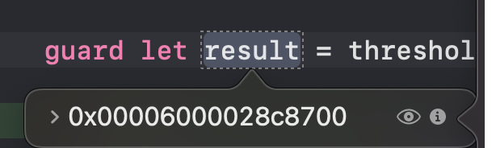
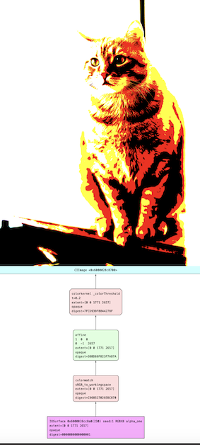

# Processing Images

Processing images == Applying filters
'image filter'는 인풋 이미지들을 pixel by pixel로 검사하면서(examine) 알고리즘적으로(algorithmically) 어떤 이펙트를 적용하여 아웃풋 이미지를 생성하는 소프트웨어입니다.

Core Image에서 이미지 프로세싱은 `CIFilter`(필터)와 `CIImage`(인풋 아웃풋) 클래스에 의존합니다.

필터를 적용하고, 결과를 보여주거나(Display) 내보내기(Export)위해서는 Core Image와 다른 시스템 프레임워크 간의 통합을 하거나, `CIContext`클래스를 사용하여 자체 *rendering workflow*를 만드는 방법이 있습니다.

## OverView

간단한 예시를 살펴보겠습니다.

```swift
let context = CIContext() // 1

let thresholdFilter = CIFilter.colorThreshold() // 2
thresholdFilter.inputImage = image
thresholdFilter.threshold = 0.2

guard let result = thresholdFilter.outputImage else { fatalError() } // 3

let cgImage = context.createCGImage(result, from: result.extent) // 4
```

1. `CIContext`를 default 옵션을 사용하여 선언해주었습니다. `CIContext` 없이도 알아서 렌더링을 위해 시스템에서 만들어 주지만, `CIContext`를 따로 만들어서 사용한다면, rendering process와 rendering에 관련된 자원들에 대한 더 정밀한 컨트롤이 가능해집니다. Context는 무거운 객체입니다. 그래서 가능한 빨리 생성하고, 이미지를 프로세스 할 때마다 재사용 하는것을 추천합니다.

2. `CIFilter`를 사용하여 이미지에 필터를 주는 코드입니다. 저기서 `inputImage`에 들어가는 `image`는 `CIImage`로 프로세스 될 이미지를 나타냅니다.

3. `result`는 `thresholdFilter`의 아웃풋 이미지입니다. 이 `result`에 breakpoint를 걸고 다음 줄을 실행하면 이미지를 확인할 수 있습니다.
  
  

4. 아웃풋 이미지를 Core Graphics 이미지로 생성해주고, 이 `cgImage`를 Display 하거나 Save 합니다.
