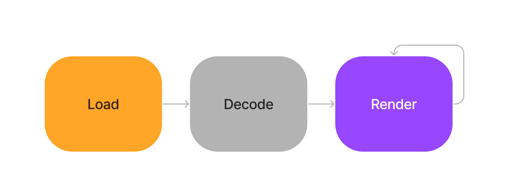
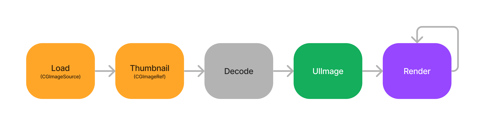

# Image and Graphics Best Practices(WWDC 18)

## Memory and CPU

### Memory, CPU에 따른 Battery Life와 응답성

CPU 사용량이 높으면, Battery Life와 응답성이 떨어진다.
Memory 사용량이 높아지면, CPU 사용량도 높아지고, Battery Life와 응답성은 더 떨어지게 된다.

## UIImageView와 UIImage

UIImage를 사용하는 Graphical Content

- Photography(사진)
- Iconography(버튼 아이콘 이미지와 같은 아이콘 이미지)

UIImageView는 이런 UIImage의 content를 보여주는 역할을 한다.
즉, UIImage(Model)은 *Load*의 역할을 가지고, UIImageView(View)는 *Render*의 역할로 명확하게 구분된다.
간단하게 보면 UIImage가 UIImageView에게 단순히 데이터만 전달하는 one-way 방식으로 보이지만, 이 과정을 자세히 살펴보면 꽤 복잡하다.

## Image Rendering Pipeline

`Rendering` 이라는 건 일시적인 이벤트가 아닌, 지속적으로 일어나는 이벤트이다. 그리고 이 Rendering pipeline에서 성능적인 측면에서 주요하게 봐야 할 부분이 바로 `Decoding`이다.

왜 `Decode`가 중요할까? 이를 위해서는 우선 `Buffer`가 무엇인지 알아야한다.

### Buffer

Buffer는 메모리에서 연속된 공간(Contiguous region of memory)을 뜻하는데, 특히 `buffer`라는 용어는 이 연속적인 공간에 있는 원소들이 같은 크기를 가진 원소들의 Sequence로 구성된 메모리 공간을 의미한다.

#### ImageBuffer

`ImageBuffer`는 메모리 내에서 이미지를 나타내기 위한 정보들을 가지고 있는 buffer를 의미한다. Buffer의 각 원소는 하나의 Pixel에 맞는 Color, Transparency 데이터를 가진다.
그리고 이 Buffer의 크기는 이미지의 크기에 비례한다.

##### FrameBuffer

주요한 기능을 하는 이미지 버퍼 중 하나가 바로 `Frame Buffer`이다. 이 Frame Buffer는 실제 앱에 render된 output을 들고 있는 버퍼이다.
예를 들어, 앱이 View 계층을 업데이트 -> UIKit이 Window와 모든 SubView들을 render하기 위한 정보를 Frame buffer에 담는다 -> Frame Buffer에는 각 Pixel에 대한 정보가 들어가고, 하드웨어가 이를 읽어 pixel을 화면에 보여주는 역할을 한다.
여기서 이 마지막 과정(Frame Buffer -> Display)이 60hz - 120hz 즉, 1초에 60회 혹은 120회 이루어진다.

#### DataBuffer

Image Buffer와 비교해 볼 DataBuffer는 메모리에 이미지 파일의 content를 저장한다.
주로 MetaData에 대한 정보와 JPEG, PNG와 같은 인코딩된 이미지 파일에 대한 정보를 가진다.

UIImage는 처음 Network를 통해서나, 로컬 저장소를 통해서나 Image File을 받아올 것이다. 이때 이 이미지 파일에 대한 Data Buffer를 가진다.

그렇다면 이를 어떻게 Frame Buffer로 변환하여 Display까지 할 수 있을까?
-> 여기서 UIImage는 `Decoding`을 통해 *DataBuffer를 ImageBuffer로 변환하는 작업을 수행한다.* 이 과정에서 JPEG, PNG와 같이 인코딩된 이미지 파일 데이터를 픽셀당 이미지 데이터로 변환시켜, ImageBuffer에 넣는 과정이 이루어진다. *이 Decoding 과정은 CPU를 많이 사용한다.(CPU intensive)*

그렇기 때문에 UIImage는 이 작업을 매번 수행하지 않고, 한번만 수행한 후, Image Buffer를 가지고 있는다. 그런데 이렇게 하면, 결과적으로 이미지의 크기가 큰 이미지일수록, 많은 메모리를 잡아먹게 된다. 그리고, 들고있는 이 Image Buffer의 크기는 실제 View에 보여질 이미지 크기가 아닌, 원본 이미지의 크기를 가지고 있다.

### DownSampling

결론적으로, 원본 이미지의 사이즈 보다는, 실제 화면에 보여질 `Frame Buffer`에 크기에 맞는 사이즈를 가진 `Image Buffer`를 생성하는 것이 주요한 포인트이다.
그러기 위해서 설명해주는 기법이 `Down sample`이다.

과정을 살펴보면, 꽤나 간단했다. Load 과정에서 `CGImageSource`를 사용한다. 이때, 옵션으로 `kCGImageSourceShouldCache: false`를 해주는데, URL에서 이미지를 받아올 때, 바로 Decoding하여 Image Buffer를 생성하지 않기 위해서이다.

다음은 Frame buffer에 표시될 이미지의 x, y축 사이즈를 계산하고, thumbnail을 위한 option을 만들어주는데, 여기서 또 중요한 옵션이 `kCGImageSourceShouldCacheImmediately: true`이다. 이제 이 downsample된 이미지에 대해서는 Decode 하여 `Image Buffer`를 생성해준다.

그래서 이는 작은 이미지들을 여러개 보여주는 앨범과 같은 화면 (CollectionView, TableView)에 사용될 때 메모리 측면에서 많은 이점을 가지게 된다. 하지만 이런 CollectionView, TableView, ScrollView와 같이 스크롤이 가능한 View에서 발생하는 문제가 있다.
스크롤을 내리면 새로운 Row를 가져오면서 이미지를 가져와야하는데, Core Graphics는 해당 Cell에 들어갈 이미지에 대한 Decoding 작업을 실행한다. 하지만 이 작업에서 많은 CPU 타임을 가져가게 되는 문제가 발생한다. 그럼 유저 입장에서는 앱이 멈춘것처럼 보이게 된다.

#### Prefetching & Background decoding / downsampling

위의 Scrollable view에서 발생하는 문제를 해결하는 방법으로 `Prefetching`과 `Background decoding`, `Background downsampling`이 있다. UICollectionView를 예로 들면, `collectionview(_: prefetchItemAt:)` 메서드를 사용하여 내부에 Background decoding, downsampling을 구현해준다. 여기서 global queue를 사용하여 background 작업을 수행하면 `Thread explosion`이 발생할 수 있는데, (자세한 내용은 WWDC 17 - Modernizing Grand Central Dispatch Usage) 이를 해결하기 위해
Serial queue를 사용하여 진행하는게 더 효율적이다.

## Image Sources

Image를 가져올 수 있는 방법은 다양하다. 만약 앱 내에서 이미지를 가져온다면, Asset을 사용하는 것을 강력하게 추천한다고 한다.
장점은 다음과 같다.

- Optimized name and trait-based lookup
- Smarter buffer caching
- per-device thinning
- vector artwork

다음 - Custom Drawing with UIKit
